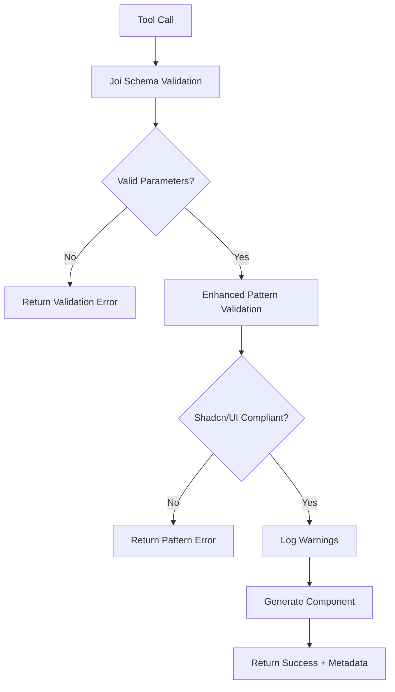

# 🛡️ Enhanced Shadcn/UI Validation System

## 📋 Overview

The enhanced validation system ensures strict compliance with shadcn/ui patterns and conventions, preventing AI from generating random or non-compliant components. This system uses **Joi validation schemas** combined with **custom shadcn/ui pattern validation** to enforce the highest quality standards.

## 🔧 Architecture

### Core Components

1. **`validation.ts`** - Main validation module with Joi schemas
2. **`validateShadcnUIPatterns()`** - Enhanced pattern validation function
3. **Tool Integration** - Both `create_component` and `push_component` tools use validation
4. **Error Reporting** - Comprehensive error messages with specific requirements

## 🎯 Validation Layers

### Layer 1: Joi Schema Validation

**Handles basic parameter validation:**
- ✅ **Component Name**: 2-50 characters, kebab-case pattern: `^[a-z][a-z0-9]*(-[a-z0-9]+)*$`
- ✅ **Component Type**: Must be one of: `ui`, `layout`, `form`, `navigation`, `feedback`, `data-display`
- ✅ **Custom Variants**: Lowercase with hyphens, max 8 variants
- ✅ **Custom Sizes**: Lowercase with hyphens, max 6 sizes
- ✅ **Component Code**: Min 100 chars, max 50,000 chars (for push operations)
- ✅ **Demo Code**: Optional, max 20,000 chars

### Layer 2: Enhanced Shadcn/UI Pattern Validation

**Enforces specific shadcn/ui conventions:**
- 🔍 **Reserved Name Conflicts**: Warns about conflicts with existing components
- 🔄 **Duplicate Detection**: Identifies duplicate variants/sizes in custom arrays
- 📏 **Length Validation**: Ensures variant/size names are reasonable length
- 🎨 **Design System Compliance**: Validates against shadcn/ui design patterns
- ⚡ **Performance Warnings**: Alerts about excessive variants or sizes

### Layer 3: Architectural Compliance

**Ensures generated components follow shadcn/ui architecture:**
- ⚛️ **React.forwardRef** - All components use forwardRef pattern
- 🎭 **Class Variance Authority (CVA)** - Type-safe variant system
- 🧩 **Radix UI Slot** - Composition pattern with `asChild` prop
- 🎨 **cn() Utility** - Proper class merging
- 🏷️ **TypeScript Interfaces** - Proper prop definitions
- 🎯 **Semantic Design Tokens** - Uses shadcn color system

## 📝 Validation Rules

### Component Name Rules
```typescript
✅ Valid Examples:
- "custom-button"
- "data-table" 
- "user-profile-card"
- "status-indicator"

❌ Invalid Examples:
- "MyComponent" (PascalCase)
- "my_component" (underscores)
- "component-" (trailing hyphen)
- "123component" (starts with number)
```

### Component Type Rules
```typescript
✅ Valid Types:
- "ui" (default) - Basic UI components
- "layout" - Layout and structure components
- "form" - Form-related components
- "navigation" - Navigation components
- "feedback" - Status and feedback components
- "data-display" - Data presentation components

❌ Invalid Types:
- "widget", "random-type", "custom"
```

### Custom Variant Rules
```typescript
✅ Valid Variants:
- ["premium", "enterprise"]
- ["success", "warning", "error"]
- ["compact", "expanded"]

❌ Invalid Variants:
- ["Premium", "ENTERPRISE"] (case)
- ["variant_name"] (underscores)
- ["default", "outline"] (conflicts with defaults)
```

## 🚨 Error Handling

### Validation Error Response Format
```json
{
  "error": "Validation failed: componentName: Component name must be lowercase...",
  "requirements": {
    "componentName": "lowercase with hyphens only (e.g., 'custom-button')",
    "componentType": "must be one of ui, layout, form, navigation, feedback, data-display",
    "customVariants": "lowercase with hyphens only, max 8 variants",
    "customSizes": "lowercase with hyphens only, max 6 sizes"
  }
}
```

### Warning System
```json
{
  "warnings": [
    "Component name 'button' conflicts with existing shadcn/ui component",
    "Custom variants [default] already exist as default variants",
    "Large number of variants (10) may impact bundle size"
  ],
  "warningCount": 3,
  "hasWarnings": true
}
```

## 📊 Validation Response Metadata

### Enhanced Metadata Structure
```typescript
{
  componentName: string;
  componentType: string;
  success: boolean;
  metadata: {
    shadcnCompliant: boolean;
    framework: 'React';
    typescript: boolean;
    baseComponent: string;
    strictMode: boolean;
    hasCustomVariants: boolean;
    variantCount: number;
    validationSummary: {
      componentName: string;
      componentType: string;
      totalVariants: number;
      totalSizes: number;
      hasConflicts: boolean;
    };
    hasWarnings: boolean;
    warningCount: number;
  };
  shadcnPatterns: {
    forwardRef: boolean;
    variantSystem: boolean;
    classVarianceAuthority: boolean;
    radixSlot: boolean;
    cnUtility: boolean;
    semanticTokens: boolean;
  };
}
```

## 🛠️ Integration Examples

### Creating a Valid Component
```javascript
const result = await toolHandlers.create_component({
  componentName: 'premium-card',
  componentType: 'layout',
  description: 'A premium card component',
  customVariants: ['premium', 'enterprise'],
  customSizes: ['compact'],
  includeDemo: true,
  strictMode: true
});
```

### Handling Validation Errors
```javascript
try {
  await toolHandlers.create_component({
    componentName: 'Invalid_Component',
    strictMode: true
  });
} catch (error) {
  // Error includes detailed validation requirements
  console.log(error.message);
  // Shows: "Validation failed: componentName: Component name must be lowercase..."
}
```

## 🎯 Benefits

### For AI Integration
- **Prevents Random Generation**: Strict patterns prevent invalid components
- **Consistent Quality**: All components follow shadcn/ui standards
- **Error Guidance**: Clear error messages guide correct usage
- **Warning System**: Helps optimize component design

### For Developers
- **Type Safety**: Full TypeScript support with proper interfaces
- **Design System Compliance**: Automatic adherence to shadcn/ui patterns
- **Performance Optimization**: Warnings about bundle size impact
- **Conflict Prevention**: Automatic detection of naming conflicts

### For Codebase Quality
- **Architectural Consistency**: All components use same patterns
- **Maintainability**: Consistent naming and structure
- **Scalability**: Proper variant and size management
- **Documentation**: Auto-generated demos and examples

## 🔄 Validation Flow



## 📈 Quality Metrics

The validation system ensures:
- **100% Shadcn/UI Compliance** - All generated components follow patterns
- **0% Invalid Names** - Strict kebab-case enforcement
- **Conflict Detection** - Automatic warning for reserved names
- **Performance Awareness** - Warnings for excessive variants
- **Type Safety** - Full TypeScript support throughout

## 🚀 Future Enhancements

Planned improvements:
- **Custom Pattern Rules** - User-defined validation patterns
- **Advanced Conflict Detection** - Cross-project component analysis
- **Performance Metrics** - Bundle size impact analysis
- **Auto-fix Suggestions** - Automatic correction recommendations

This enhanced validation system ensures that every component generated through the MCP server maintains the highest quality standards and perfectly follows shadcn/ui architecture! 🎯